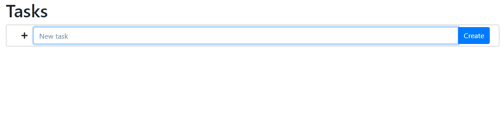

Basic Task App
===

The purpose of this repo is to test drive the
[React](https://reactjs.org/) + 
[Flask](https://flask.palletsprojects.com/) + 
[MongoDB](https://www.mongodb.com/) stack.
See details [here](./docs/CONTRIBUTING.md).

Feature Set
---

- Manage tasks
  - ➕ Create tasks
  - ✏️Edit tasks
  - 🗑️ Delete tasks
- ↕️Drag and drop tasks to change priority
  - You can also drag the task adder, new tasks will be added below the task adder
- 🗒️ Add a notes to tasks (supports [markown](https://www.markdownguide.org/))
- 📍 Add a location to a task
- ✔️Mark tasks complete (with satisfying animation)
