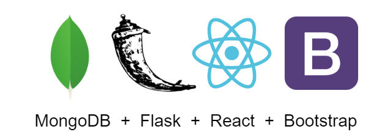

## Setup to develop

##### Get your machine setup

- Install npm (part of [Node](https://nodejs.org/en/))
- Install [MongoDB](https://www.mongodb.com/)
- Install [python](https://www.python.org/)
  - Setup a python [virtualenv](https://docs.python.org/3/tutorial/venv.html) (optional)
  - Run `pip install -r requirements.txt`
- Add the following to your machine's hosts file:
  - `127.0.0.1 todoapp.local`
  - `127.0.0.1 static.todoapp.local`
- For end to end tests, install [ChromeDriver](https://sites.google.com/a/chromium.org/chromedriver/home)
- For better debugging, install the [React Developer Tools](https://reactjs.org/blog/2015/09/02/new-react-developer-tools.html) chrome extension

##### Run the debug setup

- Run `run_development_setup.py` which will
  - Check your setup
  - Start the file watcher
  - Start the development server
- The site will be accessible at <http://todoapp.local:5000/>
  - API doc (swagger) at <http://todoapp.local:5000/api/v1/>

##### Run the tests

API tests: `tox`

JS tests: `npm test`

End to end tests: `tox -e end_to_end`

##### Run the linters

Back end: `tox -e pylint`

Front end: `npm run lint`

Tech stack
---

Back end:
- [MongoDB](https://www.mongodb.com/)
- [Flask](https://flask.palletsprojects.com/)

Front end:
- [React](https://reactjs.org/)
- [Bootstrap](https://getbootstrap.com/)
  (via [React-Bootstrap](https://react-bootstrap.github.io/))

Other tools:
- Python test automation manager: [tox](https://tox.readthedocs.io/en/latest/)
- Python linter: [Pylint](https://www.pylint.org/)
- Task runner: [npm](https://www.npmjs.com/) scripts
- Bundler: [webpack](https://webpack.js.org/)
- JS test runner: [Jest](https://jestjs.io/)
- JS linter: [ESLint](https://eslint.org/)
- Style sheet complier: [Sass](https://sass-lang.com/)
- End to end test driver: [Selenium](https://www.selenium.dev/)

Workflows
---

Work on [feature|bug]:
- Create a branch (no prefix)
- Update
  - API tests if applicable
  - JS tests if applicable
  - End to end tests if adding critical workflow
- Implement and test locally
  - Run any applicable end to end tests locally
  - Run the linters locally
- Push branch and create PR
  - Address comments
  - Fix any issues found by the build

Release:
- Changes in main are always deployed to demo site automatically
