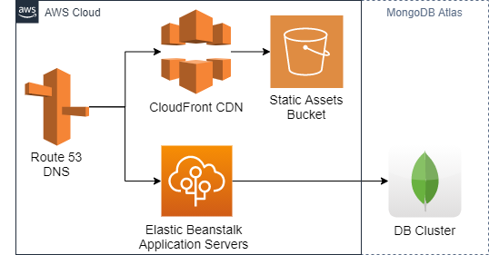

Deployment Architecture
===

The demo application is deployed on AWS.



AWS Configuration:
---

####Route 53

The domain  name is registered via AWS Route 53.
Auto renew is enabled to avoid losing the domain name.
Transfer lock is enabled for extra protection.

A hosted zone was created for the domain.
It contains:

- SOA, NS records for the domain
- CNAME for ongoing validation (see below)
- Alias record for tododemo.houstonfortney.com to the elastic beanstalk environment
- Alias record for static.tododemo.houstonfortney.com to the cloudfront distribution

####Certificate Manager

SSL certs are managed by AWS Certificate Manager.

A certificate for *.tododemo.houstonfortney.com is used by the CloudFront
distribution. Per AWS, the certificate must be in the us-east-1 region
for CloudFront.

A CNAME record in the hosted zone is used for ongoing verification of 
the domain whenever it needs to be renewed.

####S3 for static assets

The purpose of this bucket is to serve static resources publicly, 
public access must be granted.
First, block public access must be turned off for the bucket.
Then the following was added to the bucket to allow public access.

```
{
    "Version": "2012-10-17",
    "Statement": [
        {
            "Sid": "PublicReadGetObject",
            "Effect": "Allow",
            "Principal": "*",
            "Action": "s3:GetObject",
            "Resource": "arn:aws:s3:::tododemo-static/*"
        }
    ]
}
```

The following CORS policy was attached to the bucket:

```
[
    {
        "AllowedHeaders": [
            "*"
        ],
        "AllowedMethods": [
            "GET"
        ],
        "AllowedOrigins": [
            "*.houstonfortney.com"
        ],
        "ExposeHeaders": [],
        "MaxAgeSeconds": 3000
    }
]
```

####CloudFront CDN

AWS CloudFront is used for content distribution.
This provides edge caching of static resources as well as SSL.

The origin request policy must be set to `Managed-CORS-S3Origin`.

Static assets are always deployed to `/<version_number>/*`.
This inherently invalidates browser and CDN caching.

####Elastic beanstalk

EC2 resources are not managed directly.
AWS Elastic Beanstalk provides a managed platform which handles:
- Provisioning
- Instance configuration (reverse proxy and WSGI server)
- Monitoring
- Application and platform update

A single instance environment is used for the demo site to reduce cost.

####S3 for secrets management

The app servers need secret information that only they may access.
In this application this includes:

- DB credentials
- Secret key for flask sessions

These secrets are stored in an S3 bucket. This bucket:

- Has block all public access enabled
- Uses server-side encryption
- Has the following policy which grants access to only the app servers

```
{
    "Version": "2012-10-17",
    "Id": "Policy1606609374825",
    "Statement": [
        {
            "Sid": "Stmt1606609367833",
            "Effect": "Allow",
            "Principal": {
                "AWS": "arn:aws:iam::551199105789:role/aws-elasticbeanstalk-ec2-role"
            },
            "Action": "s3:GetObject",
            "Resource": "arn:aws:s3:::tododemo-secrets/secrets.py"
        }
    ]
}
```

The IAM role must be assigned to the instanced (in environment configuration)
and have the `AmazonS3ReadOnlyAccess` policy.

The app servers then download the secrets using [boto](https://github.com/boto/boto3),
the AWS python package during initialization of the application.
See [`application.py`](../application.py).

####MongoDB

The demo site uses a free (M0) cluster on mongodb.com.
A TTL index is used to automatically delete demo tasks to keep the database small.

Because the app server IP addresses are unknown,
network access must be configured to allow access from anywhere.
This is not appropriate for production, see scaling notes below.

Scaling Notes
---

This deployment is a demo site with the goal of very low operating cost.
The following changes should be implemented for a production deployment of this stack.

- Load Balancer/Autoscaling for App servers (upgrade elastic beanstalk settings)
- SSL on Load Balancer
- Upgrade database layer
  - At a minimum, an M2 cluster to enable backup storage
  - Another option is amazon DocumentDB
  - If mongodb hosting is retained, network peering with the AWS VPC should be implemented
